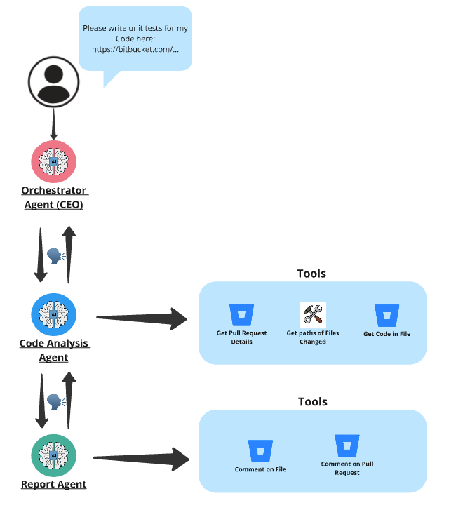

# Code Scout Agency

This is the repository for the infamous Code Scout AI Agency powered by Agency Swarm. This AI Agency is used to analyse 
BitBucket Pull Requests and suggest Unit Tests that can be created.

This agency is currently only catering for Bitbucket and has been fine-tuned for Python code and Pytest unit tests. 

We currently only support Open AI assistants as the underlying AI / LLM technology. 

## Structure of the Agency

The below image illustrates the structure of this AI agency. 



## How to run this Agency:

In order to run this agency, please copy the `.env.example` file to create your own `.env` file and set the values applicable 
to your own Bitbucket and Open AI instances. 

Install all required dependencies in your dedicated Python environment for this project:

```bash
pip install -r requirements.txt
```

In order to start your AI Agency, simply run:

```bash
python agency.py
```